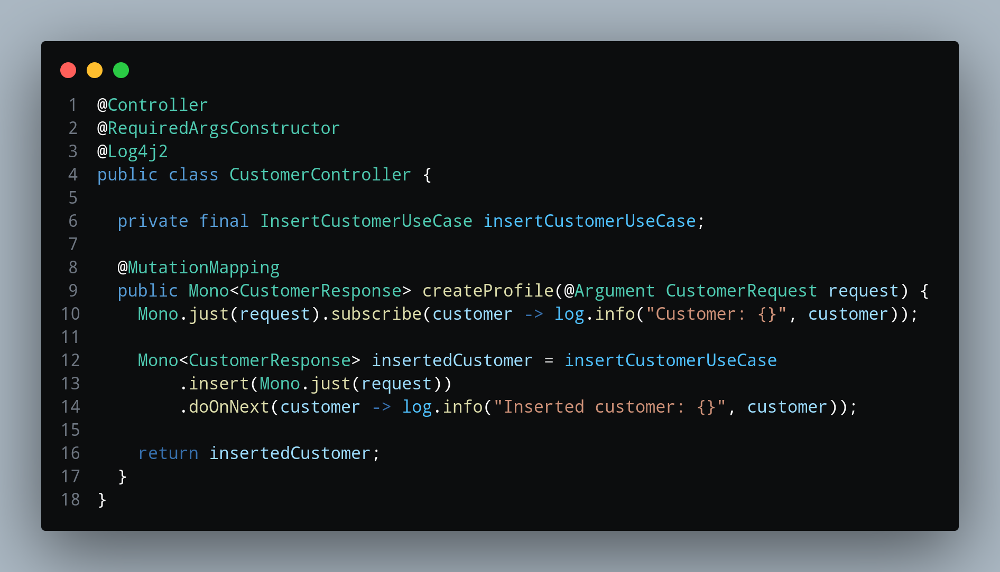

# Obsidian Dark Theme for Visual Studio Code

Welcome to the Obsidian Dark theme for Visual Studio Code. This theme provides a dark and sleek interface that's easy on the eyes, enhancing your coding experience.

## How to Use the Theme

After installing the Obsidian Dark theme, you can switch to it by going to `File > Preferences > Color Theme` and selecting `Obsidian Dark`.

Or you can use the keyboard shortcut `Ctrl + Shift + P` to open the command palette, type `color theme`, and select `Preferences: Color Theme` from the list. Then select any theme that starts with `Nocturnal`.

## Contribute

If you enjoy the Nocturnal Dark theme and would like to contribute, please feel free to submit a pull request. I'm always open to suggestions and improvements.

* [Nocturnal Dark Theme on GitHub](https://github.com/AthirsonSilva/vscode-nocturne-dark)

## License

This theme is released under the [MIT License](https://opensource.org/license/mit/)

**Enjoy coding with the Nocturnal Dark theme!**